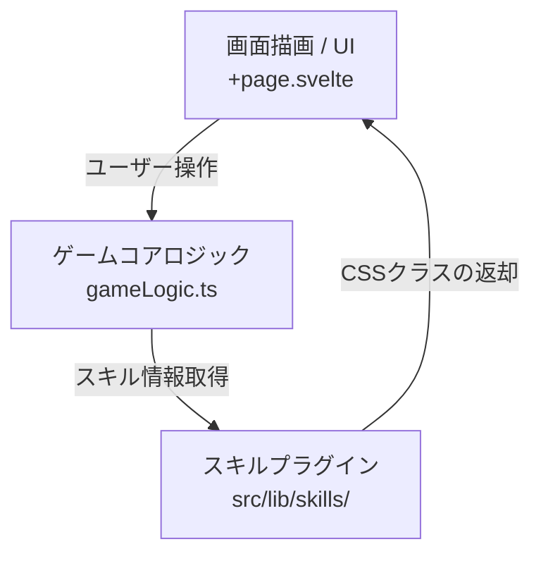

# SKILL-NEXUS (5x5 〇✕ゲーム仕様書)

本書は、SvelteKit (TypeScript) を使用して構築された 5×5 〇✕ゲーム「SKILL-NEXUS」の設計・動作ルールを定義したマスター仕様書です。

---

## 1. プロジェクト概要と特徴

### ゲームルール
- **盤面**: 5×5グリッド
- **勝利条件**: 縦・横・斜めのいずれかで自分の駒が「4マス」並んだ時点で勝利（通常はA: Circle / B: Cross）。
- **コスト（MP）制**: ターン開始時に各プレイヤーのコストが回復。コストを消費して「特殊スキル」を使用可能。
- **連続スキルコンボ**: コストが続く限り、1ターン内に何度でもスキルを使用できるコンボ性を持つ。
- **HP制への拡張性**: 将来のアップデート（HP制など）を想定し、マス目を単純な文字列ではなくオブジェクト(`Cell`型)として管理（初期HP: 1）。
- **デザイン**: 画像アセットを一切排除し、CSSアニメーションとカラーコードを用いたミニマルでモダンなレスポンシブデザイン（PCは横並び、スマホは縦並びのレイアウト）。

---

## 2. アーキテクチャと設計思想

チート防止やオンライン対戦（Node.js / WebSockets）へのスムーズな移植を考慮し、**【画面描画】**、**【ゲームコアロジック】**、**【スキルプラグイン】**の3つを完全に分離しています。



### ① 不変のガワ（UI）
- **ファイル**: `src/routes/+page.svelte`
- **役割**: ゲーム状態（`GameState`）の表示、ユーザー入力の検知、および各スキルファイルが生成したCSSクラスの描画（スタイル適用）に専念します。画面側でゲームルールやコストの直接的な加減算ロジックは持ちません。
- **最適化**: Firebase Hosting等での初期表示（FCP/LCP）を最適化するため、`src/routes/+layout.ts`にてプリレンダリングを有効化（`prerender = true; ssr = false;`）しています。

### ② 独立したゲームコアロジック
- **ファイル**: `src/lib/gameLogic.ts`
- **役割**: 手番交代、勝利判定、コスト計算等のゲーム進行管理。UIライブラリに一切依存しない純粋なTypeScriptの関数で構成されており、そのままNode.jsサーバー側へ移植可能です。

### ③ 1スキル1ファイルのプラグイン方式（Strategyパターン）
- **配置**: `src/lib/skills/`
- **役割**: 各スキルは共通のインターフェース（`SkillModule`）を実装した独立モジュールです。既存のUIやコアロジックを書き換えることなく、新しいスキルファイルをこのフォルダに追加し、`index.ts`に登録するだけでスキルを追加可能です。

---

## 3. データ構造と変数定義

### 共通型定義 (`src/lib/types.ts`)

#### `Cell` 型
各マス目の状態を保持するオブジェクト。
```typescript
export interface Cell {
  type: 'empty' | 'circle' | 'cross'; // マスの駒状態
  hp: number;                          // マスのHP（初期値 1）
  statusEffects: string[];             // 付与されている効果状態のID
}
```

#### `GameState` 型
ゲーム全体の進行状況を保持するオブジェクト。
```typescript
export interface GameState {
  board: Cell[][];                     // 5×5の2次元配列
  currentPlayer: 'A' | 'B';            // 現在の手番プレイヤー（AまたはB）
  costs: {
    A: number;
    B: number;
  };                                   // 各プレイヤーの現在保有コスト
  winner: 'A' | 'B' | 'draw' | null;   // 勝者情報
  turnSkillCount: number;              // 現ターンにおけるスキル使用回数
  selectedSkills: {
    A: string[];
    B: string[];
  };                                   // ドラフトで選択されたスキルのIDリスト
}
```

#### アプリケーション画面状態 (`currentScreen`)
画面遷移の管理用ステート。
- `'title'`: タイトル画面
- `'settings'`: 設定モック画面
- `'modeSelect'`: 対戦モード選択画面
- `'skillSelect'`: スキルドラフト画面
- `'battle'`: 試合（対戦）画面

---

## 4. スキルモジュールの共通ルール

すべてのスキルは以下の `SkillModule` インターフェースを実装する必要があります。

```typescript
export interface SkillModule {
  id: string;                                                         // 一意の識別キー
  name: string;                                                       // スキル名称
  description: string;                                                // スキルの効果説明
  cost: number;                                                       // 消費するコスト（MP）
  targetType: 'cell' | 'player' | 'opponent' | 'global';              // スキルの対象タイプ
  
  // マスの見た目を制御するためのCSSクラスを返却
  getCellStyle(cell: Cell, x: number, y: number, state: GameState, isSelected: boolean): string;
  
  // スキル効果を適用した新しい GameState を返却
  execute(state: GameState, target?: { x?: number; y?: number }): GameState;
}
```

---

## 5. 画面遷移とゲームのフロー

```mermaid
sequenceDiagram
    participant User as プレイヤー
    participant Title as タイトル画面
    participant Mode as モード選択
    participant Draft as ドラフト画面
    participant Battle as 試合画面
    
    User->>Title: アプリ起動
    User->>Title: PLAY GAME を押下
    Title->>Mode: 画面遷移
    User->>Mode: ローカル対戦 を押下
    Mode->>Draft: 画面遷移
    Note over Draft: プレイヤーAが3つ、続いてプレイヤーBが3つのスキルをドラフト
    Draft->>Battle: 画面遷移
    Note over Battle: ドラフトしたスキルを使用しながら5x5で対戦
```

1. **初期ロード**: タイトル画面が表示されます。「SETTINGS」からは将来の実装項目（ユーザー名変更、称号一覧など）のモック画面へアクセス可能です。
2. **モード選択**: 「ローカル対戦（1画面2人プレイ）」を選択すると、スキルドラフト画面に進みます。
3. **スキルドラフト**: 
   - プレイヤーAが全スキルの中から3つを選択。
   - 続いてプレイヤーBが3つを選択。
4. **対戦開始**: 
   - プレイヤーはお互いドラフトした3つのスキルのみを使用できます。
   - スキルを使用しても手番は交代せず、コストが続く限り1ターン中に何度でも使用可能です。
   - **「駒を配置（通常攻撃）」した時点でターンが交代**し、次のプレイヤーのコストが1回復、ターン中のスキル使用回数（`turnSkillCount`）が `0` にリセットされます。

---

## 6. 将来の拡張性とゲームバランス調整への備え

対戦バランスの調整（「1ターンに使えるスキルは2回まで」や「1マッチに最大3回まで」といったコンボ数制限）を後から容易に行えるよう、`src/lib/gameLogic.ts` の `useSkill` 関数の冒頭に、バリデーション用のチェックロジックを仕込むためのプレースホルダーを設置しています。

```typescript
// ==========================================
// Future Limits Check Placeholder
// e.g. "Only 2 skills allowed per turn":
// if (state.turnSkillCount >= 2) {
//   return state;
// }
// ==========================================
```
この設計により、サーバーサイド移植時にもロジックを一括管理でき、不整合のないチート対策が可能になります。
